# Linux炫酷指令

[TOC]

-----

## 安装方法

```shell
sudo apt install [package-name]
sudo apt-get install [package-name]
```

-----

## sl | 小火车

- 可以恶搞: `alias ls=sl`

```shell
$ sl
```

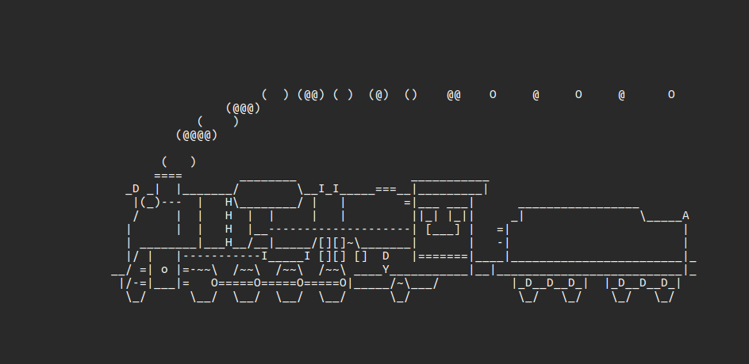

------

## fortune | 输出一句话

- 笑话
- 名言
- 唐诗宋诗
- ...

```shell
$ fortune
```

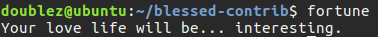

------

## cmatrix | 黑客帝国字符流

- 运行起来有点卡
- `Ctrl + C`退出

```shell
$ cmatrix
```

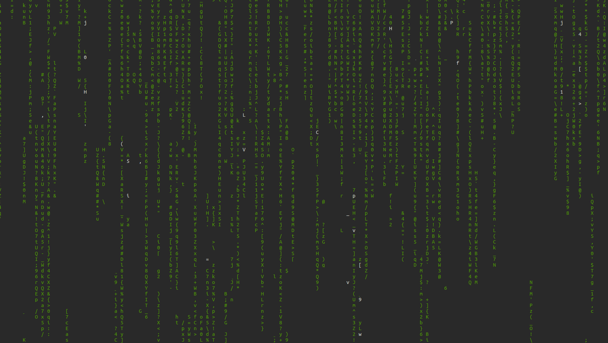

------

## 艺术字

- 可以直接写入.txt文件

### figlet | 镂空字

```shell
$ figlet hello world
```

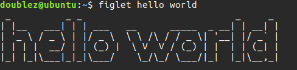

### toilet | 字符字

```shell
$ toilet hello world
```

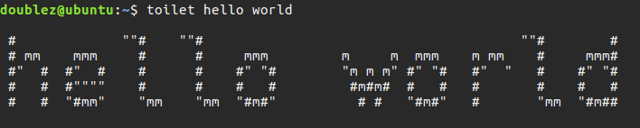

#### rainbow | 彩虹字

- rainbow是别名

- 写入.txt后仍可以读出

  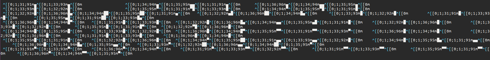

```shell
$ toilet -f mono12 -F gay hello
<=>
$ rainbow hello
```

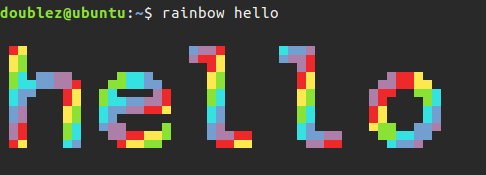

### lolcat | 渐变色

```shell
$ echo "hello world" | lolcat
```

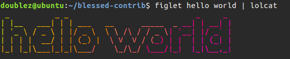

------

## 鼠标

### oneko | 小喵追鼠标

```shell
$ oneko
```


### xeyes | 盯着鼠标看

- 安装是用的`oneko`

```shell
$ xeyes
```

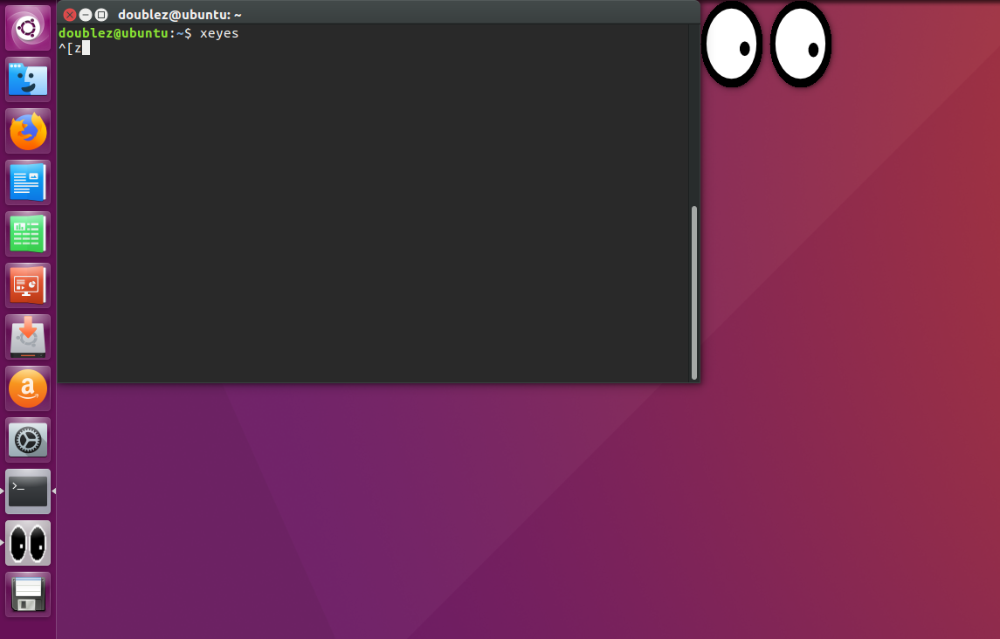

------

## 仪表盘

### hollywood | 指点江山仪表盘

- `hollywood 数字`
  - 数字指定划分的窗口数
- Ctrl + C --> Ctrl + D --> Ctrl + C退出

```shell
$ hollywood 5
```

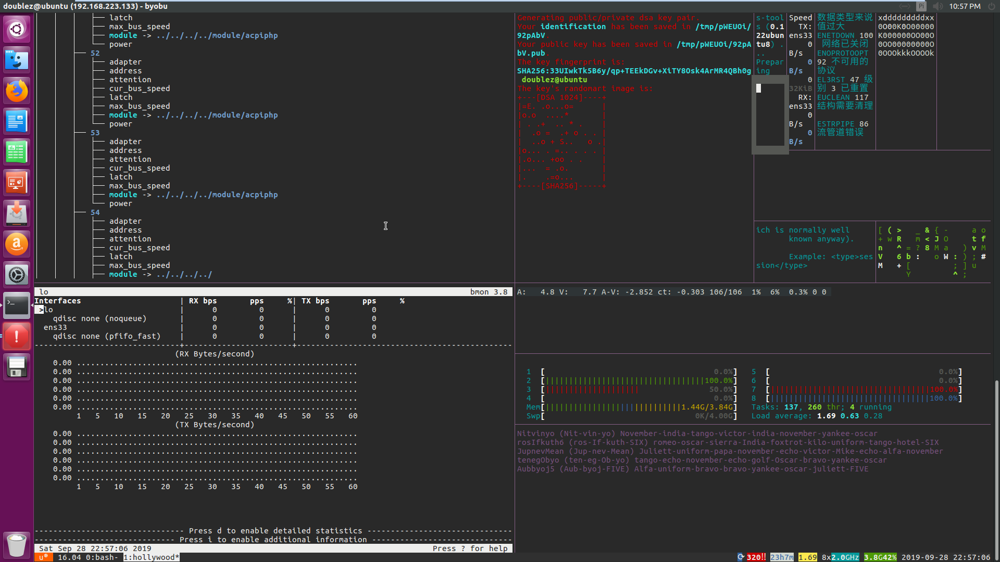

### blessed-contrib | 指点江山仪表盘

```shell
sudo apt install npm
sudo apt install nodejs-legacy
git clone https://github.com/yaronn/blessed-contrib.git
cd blessed-contrib/
npm install
node ./examples/dashboard.js
```

(卡在npm install这步)

------

## boxes | 艺术框

```shell
$ echo "Tongji University" | boxes
$ echo "Tongji University" | boxes -d dog
$ echo "Tongji University" | boxes -d cat | lolcat
```

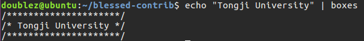

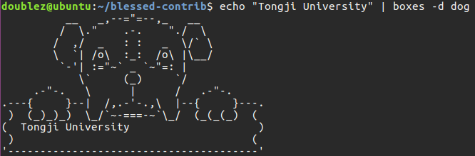

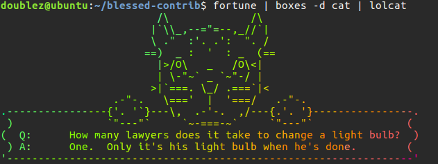

------

## aafire | 字符串火焰

- 安装包为`libaa-bin`

```shell
$ aafire
```

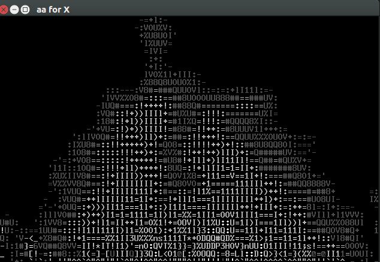

------

## asciiview | 图片转字符串

- 安装包为`aview imagemagick`
- 貌似只支持.png格式

```shell
$ asciiview photo.png
```

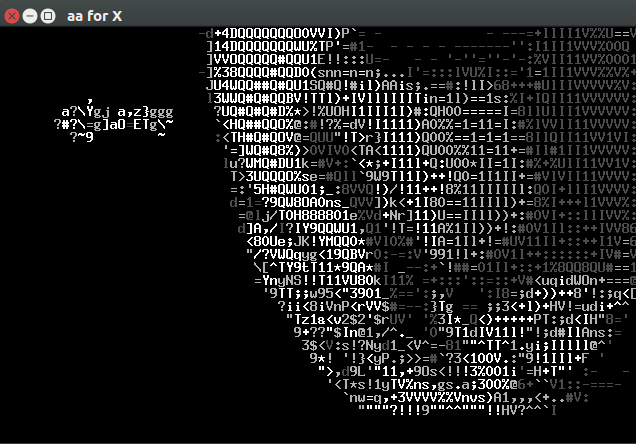